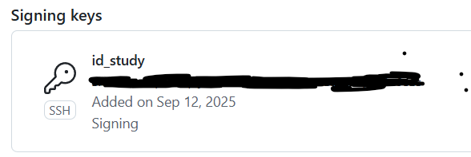
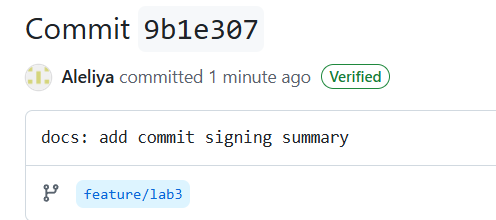
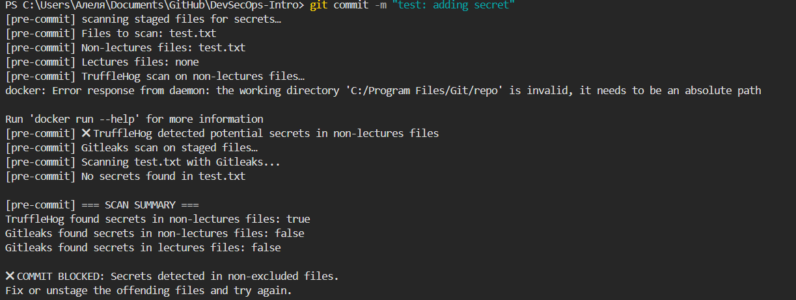
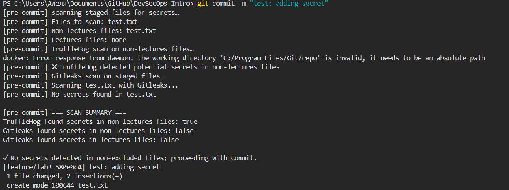

# Lab 2

## Task 1

### Benefits of signing commits for security

- It is impossible to impersonate another developer
- Guarantees that the code in the commit has not been changed after its creation
- Signed commits show that the project can be trusted

### Evidence of successful SSH key setup

### Screenshot of the "Verified" badge on GitHub

### Why is commit signing critical in DevSecOps workflows?

In modern software development, any compromised developer account can inject malicious code that propagates through CI/CD pipelines. Commit signing ensures that any unauthorized modifications can be detected before they reach production environments.

DevSecOps emphasizes traceability and accountability. Signed commits create immutable records of who made what changes and when. This is essential for security incident investigations

## Task 2

### Pre-commit hook setup process and configuration

Took from Lab 3 task, pasted it in `.git/hooks/pre-commit`, gave it permissions `chmod +x .git/hooks/pre-commit`.

### Evidence of successful secret detection blocking commits and test results

The test file with secrets (block):

The test file without secret (pass):

### How automated secret scanning prevents security incidents

Automated secret scanning prevents security incidents by proactively detecting and blocking credentials like API keys, passwords, and tokens before they can be committed to version control. This early detection aligns with DevSecOps "shift-left" principles, catching vulnerabilities at the development stage rather than after deployment.